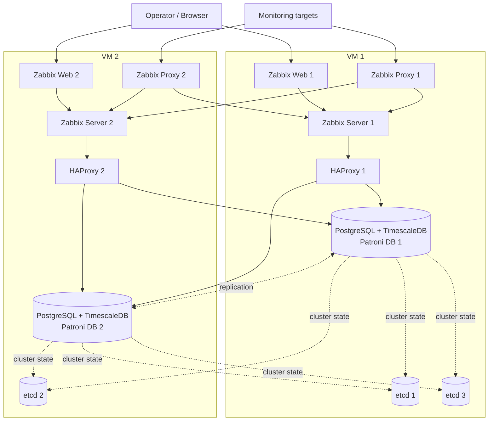

<div align="center">

# Zabbix HA Infrastructure

**두 대의 VM에서 운영하는 고가용성 Zabbix 모니터링 인프라**

[](https://www.zabbix.com/)
[](https://www.postgresql.org/)
[](https://www.timescale.com/)
[](https://patroni.readthedocs.io/)
[](https://etcd.io/)
[](https://www.haproxy.org/)
[](https://docs.docker.com/compose/)

Zabbix Server · Web · Proxy 이중화와 PostgreSQL 자동 장애 조치를 하나의 Docker Compose 기반 구성으로 제공합니다.

</div>

## 주요 특징

- **Zabbix HA**: 두 Zabbix Server 노드가 동일한 데이터베이스를 사용하며 Active/Standby로 동작
- **Database HA**: Patroni가 PostgreSQL Primary/Replica를 관리하고 etcd가 분산 상태 저장소 역할 수행
- **자동 DB 라우팅**: 각 VM의 HAProxy가 현재 Primary 데이터베이스로 연결
- **시계열 데이터 최적화**: PostgreSQL 16과 TimescaleDB 기반의 Zabbix 이력 데이터 저장
- **분산 수집**: VM별 SQLite 기반 Zabbix Proxy와 HTTP(S), DNS, RTMP 외부 점검 스크립트 제공
- **커스텀 Web UI**: 한글 로케일·나눔 폰트, 인증서 만료 위젯, 커스텀 Honeycomb 위젯 포함
- **Configuration as Code**: 수집·이벤트 이력을 제외한 Zabbix 설정 스냅샷을 최초 DB 생성 시 자동 복원
- **영속 데이터**: etcd, PostgreSQL, Proxy 데이터를 Docker named volume에 보관

## 아키텍처



### 노드별 구성

| 구분 | VM 1 (`docker-compose1.yaml`) | VM 2 (`docker-compose2.yaml`) |
| --- | --- | --- |
| etcd | `etcd1`, `etcd3` | `etcd2` |
| Database | `patroni-db1` | `patroni-db2` |
| DB endpoint | `haproxy1` | `haproxy2` |
| Zabbix Server | `zabbix-server1` | `zabbix-server2` |
| Zabbix Web | `zabbix-web1` | `zabbix-web2` |
| Zabbix Proxy | `zabbix-proxy1` | `zabbix-proxy2` |
| 초기화 작업 | DB/스키마/TimescaleDB 초기화 | DB 초기화 완료 대기 |

> etcd quorum을 위해 VM 1에 두 멤버, VM 2에 한 멤버를 배치합니다. VM 1 장애 시에는 기존 클러스터 상태를 유지할 수 있지만 etcd quorum이 사라지므로 자동 DB 리더 선출 등 DCS 쓰기 작업이 제한됩니다.

## 기술 스택

| 영역 | 기술 | 버전 / 이미지 |
| --- | --- | --- |
| Monitoring | Zabbix Server, Web, Proxy | `7.0.29` (Ubuntu 기반 이미지) |
| Database | PostgreSQL + TimescaleDB | `16.14` + `2.28.3` |
| DB orchestration | Patroni | `4.1.3` |
| Distributed store | etcd | `3.5.21` |
| Load balancer | HAProxy | `2.8` |
| Container orchestration | Docker Compose | Compose Specification |
| Web customization | PHP, JavaScript, CSS | Zabbix 모듈 및 위젯 |
| External checks | Bash, curl, dig, rtmpdump | Proxy 이미지에 포함 |

## 시작하기

### 1. 사전 요구사항

- 서로 통신 가능한 Linux VM 2대와 고정 IP
- 각 VM에 설치된 Docker Engine 및 Docker Compose 플러그인
- 두 VM에 동일하게 체크아웃한 이 저장소
- 아래 [포트](#포트)로 통신할 수 있도록 방화벽 설정

### 2. 환경 변수 설정

두 VM에서 예제 파일을 복사합니다.

```bash
cp .env.example .env
```

`.env`의 IP와 비밀번호를 운영 환경에 맞게 수정합니다. 두 VM은 **동일한 값**을 사용해야 합니다.

```dotenv
VM1_IP=10.0.0.11
VM2_IP=10.0.0.12

POSTGRES_DB=zabbix
POSTGRES_USER=zabbix
ZABBIX_DB_PASSWORD="replace-with-a-strong-password"

PATRONI_SUPERUSER_PASSWORD="replace-with-a-strong-password"
PATRONI_REPLICATION_PASSWORD="replace-with-a-strong-password"

PHP_TZ=Asia/Seoul
```

> `.env`는 Git에서 제외됩니다. 예제 비밀번호를 그대로 사용하지 말고, 공백과 특수문자가 포함된 값은 따옴표로 감싸세요.

### 3. 클러스터 실행

#### 기존 Zabbix 설정을 함께 배포하는 경우

기존 PostgreSQL Zabbix DB에 접근할 수 있는 호스트에서 설정 스냅샷을 생성합니다. PostgreSQL 클라이언트 버전은 서버와 동일한 16 버전 사용을 권장합니다.

```bash
export SOURCE_DB_HOST=<기존-Zabbix-DB-IP>
export SOURCE_DB_PORT=5432
export SOURCE_DB_NAME=zabbix
export SOURCE_DB_USER=zabbix
export SOURCE_DB_PASSWORD='<기존-DB-비밀번호>'

bash database/init/export-zabbix-config.sh
```

결과 파일은 `database/seed/zabbix-config.dump`에 생성됩니다. 이 스냅샷에는 호스트, 템플릿, 아이템, 트리거, 사용자, 액션, 대시보드, 맵, 웹 시나리오와 프런트엔드 설정이 포함됩니다. 다음 운영 데이터는 제외됩니다.

- `history*`, `trends*` 수집값
- 이벤트, 문제, 알림, 감사 로그
- 세션, task, housekeeper 및 실시간 상태 데이터
- 네트워크 Discovery와 Autoregistration 실행 결과

덤프 파일에는 비밀번호 해시, API 토큰, Secret 매크로 또는 Webhook 인증정보가 포함될 수 있습니다. 접근이 제한된 비공개 저장소를 사용하고 필요하면 파일을 암호화하세요.

스냅샷을 Git으로 배포하려면 명시적으로 추가합니다.

```bash
git add -f database/seed/zabbix-config.dump
git commit -m "chore: seed Zabbix configuration"
git push
```

스냅샷이 없으면 기본 Zabbix 설정으로 초기화됩니다. 스냅샷이 있으면 VM 1의 `zabbix-config-restore` one-shot 컨테이너가 공식 스키마 초기화 후 설정을 복원하며, 양쪽 Zabbix Server는 복원이 끝난 뒤 시작됩니다.

> 설정 스냅샷은 **비어 있는 새 DB에 최초 1회 적용**하는 부트스트랩 자료입니다. 이미 부트스트랩된 DB와 스냅샷 체크섬이 다르면 운영 DB의 우발적인 삭제를 막기 위해 자동 복원을 거부합니다. 변경된 스냅샷으로 다시 구축하려면 DB 백업 후 클러스터의 PostgreSQL volume을 명시적으로 초기화해야 합니다.

#### Compose 실행

먼저 VM 1에서 실행합니다.

```bash
docker compose -f docker-compose1.yaml up -d --build
```

이어서 VM 2에서 실행합니다.

```bash
docker compose -f docker-compose2.yaml up -d --build
```

최초 실행 시 VM 1의 one-shot 컨테이너가 다음 작업을 자동 수행합니다.

1. PostgreSQL의 `zabbix` 역할과 데이터베이스 생성
2. TimescaleDB 확장 활성화
3. Zabbix 기본 스키마와 초기 데이터 생성
4. Zabbix TimescaleDB hypertable 초기화

VM 2의 서비스는 위 초기화가 완료될 때까지 대기한 후 시작됩니다.

### 4. 상태 확인

각 VM에서 컨테이너 상태를 확인합니다.

```bash
docker compose -f docker-compose1.yaml ps
docker compose -f docker-compose2.yaml ps
```

Patroni 클러스터와 현재 Primary를 확인합니다.

```bash
curl http://<VM_IP>:8008/cluster
curl http://<VM_IP>:8008/primary
```

`/primary` 요청은 현재 Primary 노드에서 HTTP `200`, Replica 노드에서 `503`을 반환합니다.

초기화 또는 실행 상태를 자세히 볼 때는 다음 로그를 확인합니다.

```bash
# VM 1
docker compose -f docker-compose1.yaml logs -f zabbix-db-prepare zabbix-server-db-init zabbix-config-restore

# VM 2
docker compose -f docker-compose2.yaml logs -f zabbix-db-ready
```

### 5. Zabbix 접속

브라우저에서 `http://<VM1_IP>` 또는 `http://<VM2_IP>`로 접속합니다.

Zabbix 공식 이미지의 초기 로그인 정보는 `Admin` / `zabbix`입니다. 첫 로그인 직후 관리자 비밀번호를 변경하세요.

## 포트

| 포트 | 프로토콜 | 용도 | 배치 |
| --- | --- | --- | --- |
| `80` | TCP | Zabbix Web UI | VM 1, VM 2 |
| `2379` | TCP | etcd client | VM 1, VM 2 |
| `2380` | TCP | etcd peer (`etcd1`, `etcd2`) | VM 1, VM 2 |
| `2381` | TCP | `etcd3` client | VM 1 |
| `2382` | TCP | `etcd3` peer | VM 1 |
| `5432` | TCP | HAProxy PostgreSQL Primary endpoint | VM 1, VM 2 |
| `5433` | TCP | 로컬 Patroni PostgreSQL 직접 접근 | VM 1, VM 2 |
| `8008` | TCP | Patroni REST API / 노드 연결 multiplexer | VM 1, VM 2 |
| `10051` | TCP | Zabbix Server | VM 1, VM 2 |
| `10061` | TCP | Zabbix Proxy host mapping | VM 1, VM 2 |

운영 환경에서는 필요한 네트워크 대역에서만 접근을 허용하세요. 특히 PostgreSQL, Patroni API, etcd 포트를 공용 인터넷에 노출하지 않는 것을 권장합니다.

## 커스텀 기능

### 인증서 만료 위젯

`Certificate Expiry` 위젯은 모니터링 중인 아래 아이템 키를 조회하여 만료가 가까운 인증서를 최대 20개까지 표시합니다.

- `cert.days_left[hostname,ip,port]`: 인증서 만료까지 남은 일수
- `cert.not_after[hostname,ip,port]`: 인증서 만료 Unix timestamp

남은 기간에 따라 7일 미만, 15일 미만, 30일 미만을 서로 다른 색상으로 구분하고, 항목 클릭 시 `component=cert` 태그로 필터링된 최신 데이터 화면으로 이동합니다.

### 외부 점검 스크립트

| 스크립트 | 용도 | 주요 출력 |
| --- | --- | --- |
| `web_check.sh` | 지정 IP/포트로 HTTP(S) 요청, Host/SNI 기반 점검 및 재시도 | 상태 코드, 응답 시간 JSON |
| `web_check_extra.sh` | 추가 Web 점검 엔트리 | 상태 코드, 응답 시간 JSON |
| `check_dns.sh` | 지정 DNS 서버의 A 레코드 응답 점검 | 성공 여부, 응답 시간, IP JSON |
| `check_rtmp.sh` | RTMP 스트림 수신 여부 점검 및 재시도 | 성공 `1`, 실패 `0` |

### Web UI

- `ko_KR.UTF-8` 로케일과 나눔 폰트 설치
- 인증서 만료 대시보드 위젯 추가
- Honeycomb 셀에서 호스트 메뉴와 Web Monitoring Overview 대시보드로 이동하는 기능 추가

## 운영 명령어

```bash
# 전체 로그 확인
docker compose -f docker-compose1.yaml logs -f

# 서비스 재시작
docker compose -f docker-compose1.yaml restart <service-name>

# 이미지 재빌드 후 반영
docker compose -f docker-compose1.yaml up -d --build <service-name>

# 컨테이너 중지 및 제거 (named volume은 유지)
docker compose -f docker-compose1.yaml down
```

VM 2에서는 명령어의 Compose 파일명을 `docker-compose2.yaml`로 변경합니다.

## 디렉터리 구조

```text
.
├── .env.example                 # 공통 환경 변수 예제
├── docker-compose1.yaml         # VM 1 서비스 구성
├── docker-compose2.yaml         # VM 2 서비스 구성
├── database/
│   ├── Dockerfile               # TimescaleDB HA + Patroni 이미지
│   ├── etc/patroni/patroni.yml  # Patroni bootstrap/DB 설정
│   ├── init/                    # DB 초기화 및 설정 export/restore 스크립트
│   └── seed/                    # 선택적 zabbix-config.dump 배치 위치
├── proxy/
│   ├── Dockerfile               # Zabbix Proxy + 점검 도구 이미지
│   ├── etc/zabbix/              # Proxy 설정
│   └── usr/lib/zabbix/externalscripts/
├── server/
│   └── etc/zabbix/              # Zabbix Server 튜닝 설정 참고본
└── web/
    ├── Dockerfile               # 한글화 및 커스텀 Web 이미지
    └── usr/share/zabbix/        # 인증서/Honeycomb 위젯 소스
```

## 주의사항

- etcd의 `ETCD_INITIAL_CLUSTER_STATE`는 신규 클러스터 생성을 기준으로 `new`로 설정되어 있습니다. 기존 volume을 유지한 일반 재시작에는 문제가 없지만, 클러스터를 완전히 재구성할 때는 모든 노드의 데이터 상태를 일관되게 관리해야 합니다.
- `docker compose down -v`는 데이터베이스와 etcd를 포함한 named volume을 삭제합니다. 백업 없이 운영 환경에서 실행하지 마세요.
- 현재 Patroni의 `pg_hba`에는 `172.16.0.0/12`와 `192.168.20.0/24`가 허용되어 있습니다. VM 네트워크가 다른 대역이면 `database/etc/patroni/patroni.yml`을 조정한 뒤 DB 이미지를 다시 빌드하세요.
- `server/etc/zabbix/zabbix_server.conf`는 현재 Compose 서비스에 마운트되지 않은 참고용 설정입니다. 해당 튜닝값을 적용하려면 별도의 Server 이미지 또는 volume 연결이 필요합니다.
- 이 구성은 각 VM의 Web UI를 직접 노출합니다. 단일 접속 주소와 Web 계층 자동 장애 조치가 필요하면 별도의 L4/L7 로드 밸런서 또는 VIP를 앞단에 구성하세요.
